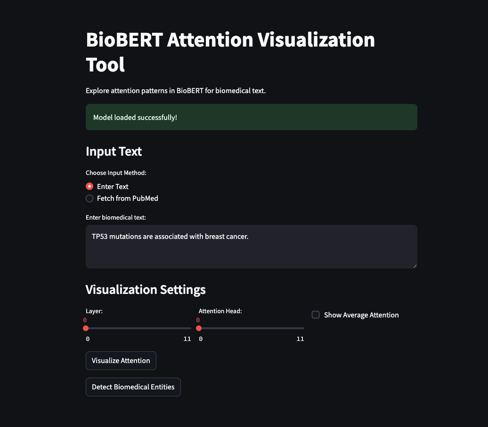

# BioBERT Attention Visualization Tool

[](https://github.com/quantnexusai/bio-attn-viz-clean/releases)
[](https://opensource.org/licenses/MIT)
[](https://github.com/quantnexusai/bio-attn-viz-clean/actions/workflows/ci.yml)
[](https://www.python.org/downloads/)

An interactive web application for visualizing attention mechanisms in BioBERT on biomedical text. This tool helps researchers and practitioners understand how transformer models process biomedical language by providing intuitive visualizations of attention patterns.



## Features

- **Attention Visualization**: Explore token-to-token attention patterns in BioBERT
- **Layer & Head Selection**: View attention weights from any layer and attention head
- **Average Attention Mode**: See the average attention across all layers and heads
- **Biomedical Entity Detection**: Identify genes, proteins, diseases, and drugs in text
- **PubMed Integration**: Fetch abstracts directly from PubMed for analysis

## Demo

Try out the live demo: [BioBERT Attention Visualization Tool](https://bio-attn-viz.streamlit.app/)

## How It Works

This tool uses the BioBERT model, a domain-specific language model pre-trained on biomedical text. When you input biomedical text, the application:

1. Processes the text through BioBERT
2. Extracts attention weights from the specified layer and head
3. Visualizes the attention patterns as an interactive heatmap
4. Detects biomedical entities using pattern matching

## Installation

To run this application locally:

```bash
# Clone the repository
git clone https://github.com/quantnexusai/bio-attn-viz-clean.git
cd bio-attn-viz-clean

# Create a virtual environment
python -m venv venv
source venv/bin/activate  # On Windows: venv\Scripts\activate

# Install dependencies
pip install -r requirements.txt

# Run the application
streamlit run app.py
```

## Project Structure

- `app.py`: Main application file with the Streamlit interface
- `model.py`: BioBERT model handling and attention weight extraction
- `visualize.py`: Attention visualization using Plotly
- `fetch_data.py`: PubMed abstract retrieval functionality
- `requirements.txt`: Project dependencies

## Technical Details

- **Model**: BioBERT-base-cased-v1.1 (domain-specific BERT model for biomedical text)
- **Frontend**: Streamlit (Python-based web application framework)
- **Visualization**: Plotly (Interactive heatmaps)
- **Entity Detection**: Regex-based pattern matching for biomedical entities
- **API Integration**: EuropePMC API for PubMed abstract retrieval

## Use Cases

- **Research**: Understand how BioBERT processes biomedical concepts
- **Education**: Teach attention mechanisms in transformer models
- **Analysis**: Identify important relationships between biomedical entities
- **Exploration**: Compare attention patterns across different biomedical texts

## Future Improvements

- Support for additional biomedical language models
- Enhanced entity detection with more sophisticated NER models
- Comparative visualization between different models or text inputs
- Export capabilities for visualizations and data

## License

MIT

## Contact

For questions or feedback, please open an issue on this repository or contact the project maintainer.

---

Built with ❤️ using Python, PyTorch, and Streamlit